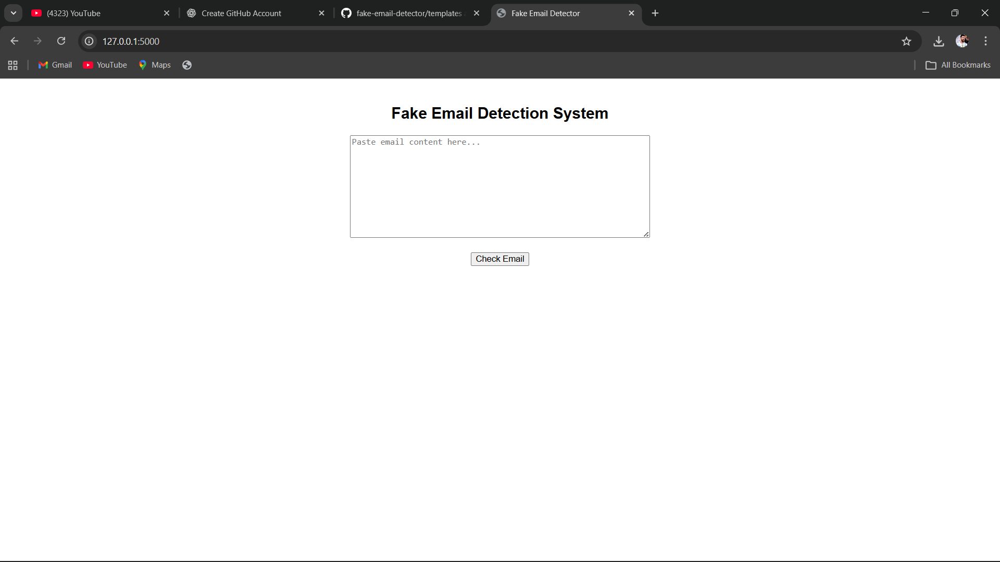
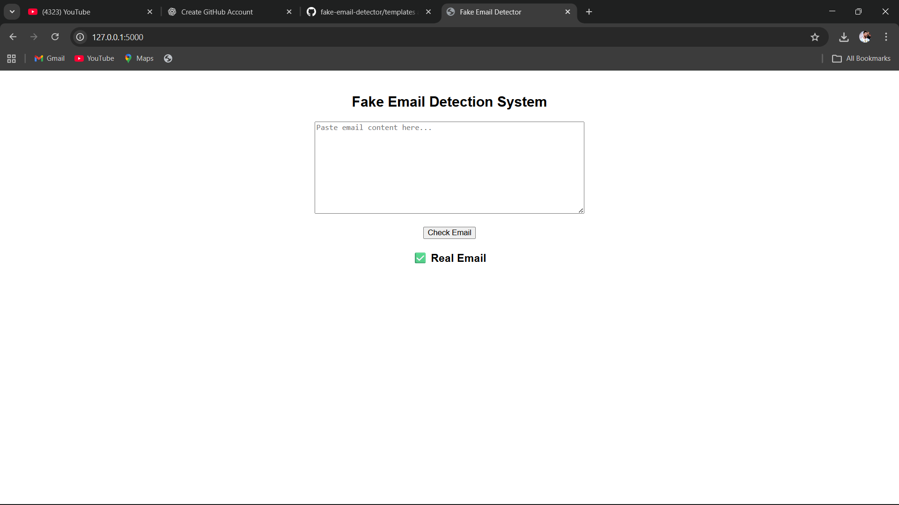

# 🛡️ Fake Email Detection Web Application

A Machine Learning–based web application that detects phishing and fake emails using Natural Language Processing (NLP).

This project combines ML model training + saved model + web deployment, making it a full end-to-end system.

---

## 📌 Project Objective

The goal of this project is to build a system that can analyze email text and predict whether it is:

- Legitimate (Safe Email)  
- Phishing / Fake (Malicious Email)  

This helps in understanding how ML can be used in cybersecurity and fraud detection.

---

## ⚙️ Technologies Used

| Area | Tools / Libraries |
|------|-------------------|
| Programming | Python |
| Machine Learning | Scikit-learn |
| NLP | TF-IDF Vectorization |
| Web Framework | Flask |
| Frontend | HTML |
| Model Storage | Pickle (.pkl) |

---

## 🧠 How the System Works

1. User enters email text  
2. Text is converted into numerical form using TF-IDF vectorizer  
3. ML model predicts if email is fake or legitimate  
4. Result is displayed on the web page  

---

## 📸 Application Screenshots

### 🏠 Home Page
User enters email content and the ML model analyzes it.

---

### 🔍 Prediction Result
The system predicts whether the email is Fake or Real.

---

## ⚙ System Flow

1. User enters email text  
2. TF-IDF converts text to numbers  
3. ML model predicts Fake or Real  
4. Result shown on webpage  

---

## 🗂 Project Structure

---

## 📂 Project Structure

